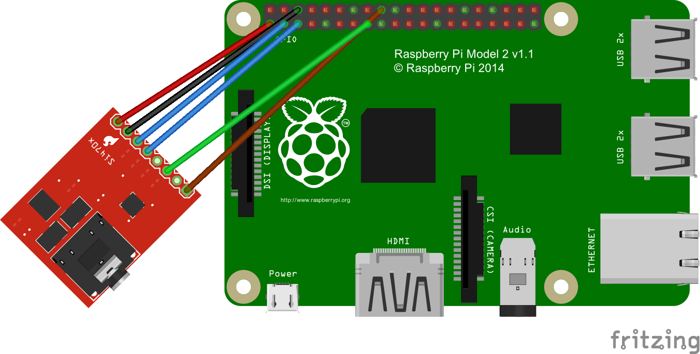

#Raspberry Pi2 and Windows 10 IoT

Windows 10 IoT library and test client using the FM Receiver Si4703 Breakout with Raspberry Pi 2. Written in C#

To get started you'll need
* [Windows 10 Insider Preview][link-win10iso]
* [Visual Studio 2015 (RC)][link-vs2015rc]
* [Raspberry Pi 2][link-rpi2]
* [Si4703 breakout board][link-si4703]
* Some jumper leads
* A breadboard to make connections easier

Once you have jumped the hoops get get Win10 running on your Pi 2 it is very simple to get an application deployed and running.

Find the IP address of your Pi on the Windows 10 IoT splash screen and configure the `Remote Machine` on the `Debug` property page of the demo app `App1`.

You will need a mouse to click the on screen buttons. Power On, then Seek and adjust volume.

I've taken a different approach to most other Arduino projects that have been writen for the Si4703. 
I am making use of the GPIO interrupt functinality for RDS and Tune/Seek operations. This allows the code to use `async` `await` rather than `delay()` or `while(true)` loops when waiting for operations to complete.

Here is how I've got mine cabled:

[link-win10iso]:http://windows.microsoft.com/en-nz/windows/preview-iso
[link-vs2015rc]:https://www.visualstudio.com/en-us/downloads/visual-studio-2015-downloads-vs.aspx
[link-win10dev]:https://dev.windows.com/en-US/iot
[link-rpi2]:http://www.element14.com/community/community/raspberry-pi/raspberrypi2
[link-si4703]:https://www.sparkfun.com/products/10663

